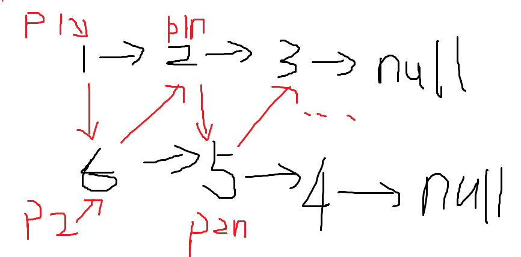

# 143 Reorder List

Given a singly linked listL:L0→L1→…→Ln-1→Ln,\
reorder it to:L0→Ln→L1→Ln-1→L2→Ln-2→…

You must do this in-place without altering the nodes' values.

For example,\
Given`{1,2,3,4}`, reorder it to`{1,4,2,3}`.

中间切一半，reverse后半部分，然后再接起来。



```java
public void reorderList(ListNode head) {
    if (head == null) {
        return;
    }

    // find mid and cut list in half
    ListNode fast = head.next;
    ListNode slow = head;
    while (fast != null && fast.next != null) {
        fast = fast.next.next;
        slow = slow.next;
    }

    ListNode laterhalf = slow.next;
    slow.next = null;

    // reverse later half
    laterhalf = reverse(laterhalf);

    // splice them together
    ListNode p1 = head;
    ListNode p2 = laterhalf;

    while (p2 != null) {
        ListNode p1n = p1.next;
        ListNode p2n = p2.next;

        p1.next = p2;
        p2.next = p1n;
        p1 = p1n;
        p2 = p2n;
    }
}

private ListNode reverse(ListNode node) {
    ListNode pre = null;
    while (node != null) {
        ListNode tmp = node.next;
        node.next = pre;
        pre = node;
        node = tmp;
    }

    return pre;
}
```
