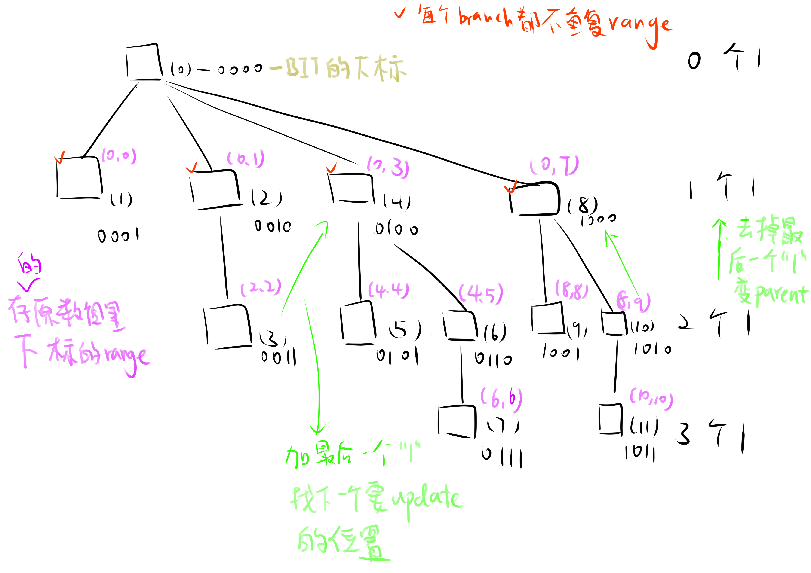

# Binary Index Tree （Fenwick Tree）



其实呢，我们需要建立一棵树，这棵树的特点是，每一个branch所表示的范围不重复。因为每一节都不overlap所以当你要求某节点到0的prefix sum时候，只要一直traverse到根节点，把沿途的val加起来就ok了。Note that BIT only supports prefix information querying, so we can only query from start to a certain element, not any interval.

LeetCode上的example

.png>)
