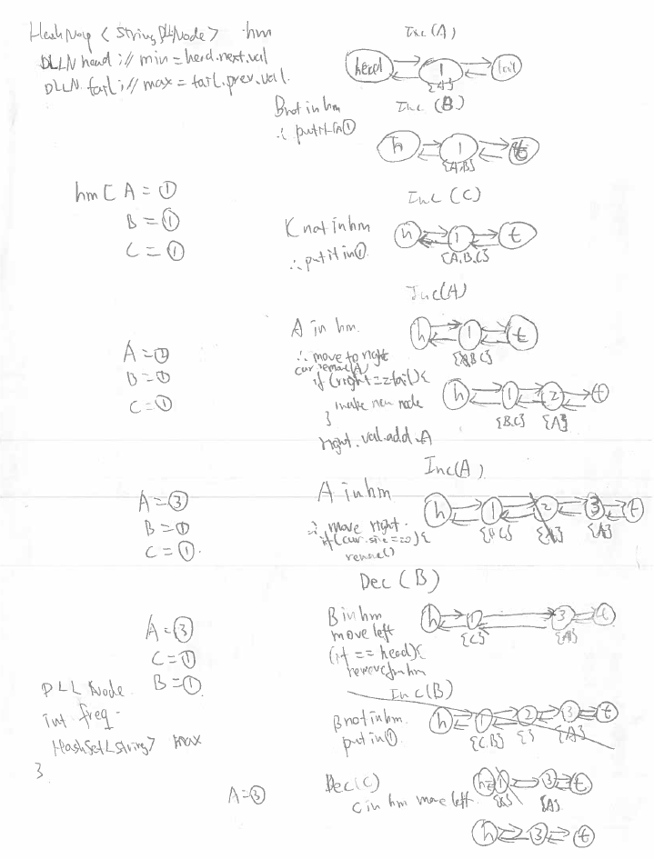

# 432 All O one Data Structure

Implement a data structure supporting the following operations:

1. Inc(Key) - Inserts a new key with value 1. Or increments an existing key by 1. Key is guaranteed to be a **non-empty** string.
2. Dec(Key) - If Key's value is 1, remove it from the data structure. Otherwise decrements an existing key by 1. If the key does not exist, this function does nothing. Key is guaranteed to be a **non-empty** string.
3. GetMaxKey() - Returns one of the keys with maximal value. If no element exists, return an empty string`""`.
4. GetMinKey() - Returns one of the keys with minimal value. If no element exists, return an empty string`""`.

Challenge: Perform all these in O(1) time complexity.

这题，感觉想出了方法，处理起来还是挺麻烦的。看到要按key来取，还O(1)，所以一定有hashmap。要达到O(1)取max，min，一开始想heap，但heap的话，插入跟删除都得logn。后来网上看到可以用double linkedlist。一开始没想通，插入删除都O(n)呀。后来发现，因为值只会+1/-1，所以每次只要从hashmap里取得node，然后处理前一个点或者后一个点就ok了。每个节点都存储了这个频率所拥有的key，然后map里存着key与相对node。max跟min就是链表的最后一个节点和最开始一个节点。插个图好理解点。



```java
public class AllOne {

    HashMap<String, Node> hm;
    Node head;
    Node tail;

    /** Initialize your data structure here. */
    public AllOne() {
        head = new Node();
        tail = new Node();
        head.freq = Integer.MIN_VALUE;
        tail.freq = Integer.MAX_VALUE;
        head.next = tail;
        tail.prev = head;
        hm = new HashMap<>();
    }

    /** Inserts a new key <Key> with value 1. Or increments an existing key by 1. */
    public void inc(String key) {
        if (!hm.containsKey(key)) {
            addToFirst(key);
        } else {
            moveRight(key);
        }
    }

    /** Decrements an existing key by 1. If Key's value is 1, remove it from the data structure. */
    public void dec(String key) {
        if (!hm.containsKey(key)) {
            return;
        }

        moveLeft(key);
    }

    private void addToFirst(String key) {
        if (head.next.freq > 1) {
            Node newNode = new Node();
            newNode.freq = 1;

            newNode.next = head.next;
            head.next = newNode;
            newNode.next.prev = newNode;
            newNode.prev = head;

            newNode.values.add(key);
            hm.put(key, newNode);
        } else {
            head.next.values.add(key);
            hm.put(key, head.next);
        }
    }

    private void moveRight(String key) {
        Node cur = hm.get(key);
        // make new node to store value
        if (cur.next.freq > cur.freq + 1) {
            Node newNode = new Node();
            newNode.freq = cur.freq + 1;

            newNode.next = cur.next;
            cur.next = newNode;
            newNode.next.prev = newNode;
            newNode.prev = cur;
        }

        cur.next.values.add(key);
        hm.put(key, cur.next);

        cur.values.remove(key);
        if (cur.values.size() == 0) {
            remove(cur);
        }
    }

    private void moveLeft(String key) {
        Node cur = hm.get(key);

        if (cur.freq - 1 == 0) {
            hm.remove(key);
        }

        if (cur.freq - 1 > 0 && cur.prev.freq < cur.freq - 1) {
            // create node            
            Node newNode = new Node();
            newNode.freq = cur.freq - 1;

            newNode.prev = cur.prev;
            cur.prev = newNode;
            newNode.prev.next = newNode;
            newNode.next = cur;
        }

        if (cur.prev.freq > 0) {
            cur.prev.values.add(key);
            hm.put(key, cur.prev);
        }

        cur.values.remove(key);
        if (cur.values.size() == 0) {
            remove(cur);
        }
    }

    private void remove(Node cur) {
        cur.prev.next = cur.next;
        cur.next.prev = cur.prev;
    }

    /** Returns one of the keys with maximal value. */
    public String getMaxKey() {
        if (tail.prev == head) {
            return "";
        }

        return tail.prev.values.iterator().next();
    }

    /** Returns one of the keys with Minimal value. */
    public String getMinKey() {
        if (head.next == tail) {
            return "";
        }

        return head.next.values.iterator().next();
    }
}

class Node {
    int freq;
    HashSet<String> values = new HashSet<>();
    Node prev;
    Node next;
}

/**
 * Your AllOne object will be instantiated and called as such:
 * AllOne obj = new AllOne();
 * obj.inc(key);
 * obj.dec(key);
 * String param_3 = obj.getMaxKey();
 * String param_4 = obj.getMinKey();
 */
```
