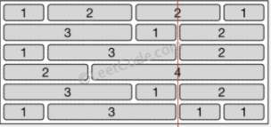

# 554 Brick Wall

There is a brick wall in front of you. The wall is rectangular and has several rows of bricks. The bricks have the same height but different width. You want to draw a vertical line from the**top**to the**bottom**and cross the**least**bricks.

The brick wall is represented by a list of rows. Each row is a list of integers representing the width of each brick in this row from left to right.

If your line go through the edge of a brick, then the brick is not considered as crossed. You need to find out how to draw the line to cross the least bricks and return the number of crossed bricks.

**You cannot draw a line just along one of the two vertical edges of the wall, in which case the line will obviously cross no bricks.**

**Example:**

```
Input:

[[1,2,2,1],
 [3,1,2],
 [1,3,2],
 [2,4],
 [3,1,2],
 [1,3,1,1]]

Output:
 2

Explanation:
```



**Note:**

1. The width sum of bricks in different rows are the same and won't exceed INT\_MAX.
2. The number of bricks in each row is in range \[1,10,000]. The height of wall is in range \[1,10,000]. Total number of bricks of the wall won't exceed 20,000.

这题一看就是line sweep，一开始把点拆开成start和end，排序然后开始数。然后发现这样做是不行的，因为这只能求最大值。这题求最小值，是不一样的line sweep。这题其实只要算end，每次用墙的总数减去现在end了多少，剩下的值就是现在跨了多少墙。每个location的数目用hashmap来存，最后一个end不用算，因为会是0。还有记得放0，0到map里，因为一开始有6堵墙。

看了答案才发现，我去，其实可以求最大值，return时返回wall.size() - max。心累。

```java
public int leastBricks(List<List<Integer>> wall) {
    if (wall == null || wall.size() == 0) {
        return 0;
    }

    int rowsize = wall.size();
    // collect all start and end point
    // <location, wall count>
    HashMap<Integer, Integer> hm = new HashMap<>();
    hm.put(0, 0);// must have this, [[1], [1], [1]] return 3
    for (List<Integer> row : wall) {
        int loc = 0;
        for (int i = 0; i < row.size() - 1; i++) {
            loc += row.get(i);                
            if (hm.containsKey(loc)) {
                hm.put(loc, hm.get(loc) + 1);
            } else {
                hm.put(loc, 1);
            }

        }
    }

    int min = Integer.MAX_VALUE;
    // line sweep
    for (Map.Entry<Integer, Integer> entry : hm.entrySet()) {
        int wallNum = rowsize - entry.getValue();
        //if (wallNum >= 0) {
            min = Math.min(wallNum, min);
        //}
    }

    return min;
}
```

看了tutorial还发现了一点，如果把min的初始值设成wallsize的话，可以省去hm.put（0，0）...囧

```java
public int leastBricks(List<List<Integer>> wall) {
    if (wall == null || wall.size() == 0) {
        return 0;
    }

    int rowsize = wall.size();
    // collect all start and end point
    // <location, wall count>
    HashMap<Integer, Integer> hm = new HashMap<>();
    for (List<Integer> row : wall) {
        int loc = 0;
        for (int i = 0; i < row.size() - 1; i++) {
            loc += row.get(i);                
            if (hm.containsKey(loc)) {
                hm.put(loc, hm.get(loc) + 1);
            } else {
                hm.put(loc, 1);
            }

        }
    }

    int min = rowsize;
    // line sweep
    for (Map.Entry<Integer, Integer> entry : hm.entrySet()) {
        int wallNum = rowsize - entry.getValue();
        min = Math.min(wallNum, min);
    }

    return min;
}
```
