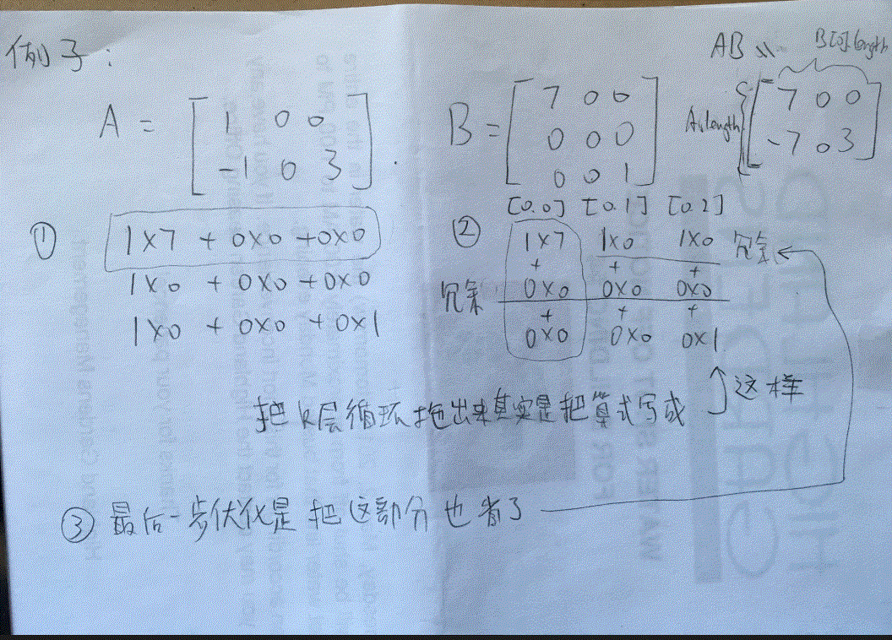

# 311 Sparse Matrix Multiplication

Given two[sparse matrices](https://en.wikipedia.org/wiki/Sparse_matrix) **A** and **B**, return the result of **AB**.

You may assume that **A**'s column number is equal to **B**'s row number.

**Example:**

```
A = [
      [ 1, 0, 0],
      [-1, 0, 3]
    ]


B = [
    [ 7, 0, 0 ],
    [ 0, 0, 0 ],
    [ 0, 0, 1 ]
  ]


     |  1 0 0 |   | 7 0 0 |   |  7 0 0 |
AB = | -1 0 3 | x | 0 0 0 | = | -7 0 3 |
                  | 0 0 1 |
```



这题的终极版：下面一个算法，只利用了A是sparse的特性。如果要利用B也sparse的特性的话，我们可以把内层循环的数目减少。其实我们不用把j从头到尾loop一遍，我们用O(n2)的时间把不为0的j的位置找出来，内层循环，只loop那些不为0的就ok了。听说，matrix multiplication是O(n2.几）的算法，不能优化为O(n2)的。

```java
/**
 * @param A: a sparse matrix
 * @param B: a sparse matrix
 * @return: the result of A * B
 */
public int[][] multiply(int[][] A, int[][] B) {
    if (A == null || B == null) {
        return null;
    }

    int n = A.length;
    int m = B[0].length;
    int[][] res = new int[n][m];

    List<List<Integer>> nonZeroB = new ArrayList<>();
    for (int i = 0; i < B.length; i++) {
        nonZeroB.add(new ArrayList<>());
        for (int j = 0; j < m; j++) {
            if (B[i][j] != 0) {
                nonZeroB.get(i).add(j);
            }
        }
    }

    for (int i = 0; i < A.length; i++) {
        for (int k = 0; k < A[0].length; k++) {
            if (A[i][k] == 0) {
                continue;
            }

            for (Integer j : nonZeroB.get(k)) {
                res[i][j] += A[i][k] * B[k][j];
            }
        }
    }

    return res;
}
```

这题第一种想到的方法十分之慢，就是直接按照矩阵乘法去做。虽然发现了0就直接跳过，但这样效率还是很低。（贴上来做参考）后来看了discuss答案之后发现，应该把check 0的那一个loop抽出来。这样就可以把一行/一列直接跳过。

```java
    public int[][] multiply(int[][] A, int[][] B) {
        if (A == null && B == null) {
            return null;
        }

        int n = A.length;
        int m = B[0].length;
        int[][] result = new int[n][m];

        for (int i = 0; i < n; i++) {
            for (int k = 0; k < A[0].length; k++) { // pull this loop out to check 0 earlier
                if (A[i][k] == 0) {
                    continue;
                }
                for (int j = 0; j < m; j++) {
                    if (B[k][j] == 0) { // 其实这一步每次只优化了一句话，所以没什么鸟用
                        continue;
                    }
                   result[i][j] += A[i][k] * B[k][j];
                }
           }
       }

       return result;
    }
```

很慢的：

```java
    public int[][] multiply(int[][] A, int[][] B) {
        if (A == null && B == null) {
            return null;
        }

       int n = A.length;
       int m = B[0].length;
       int[][] result = new int[n][m];

       for (int i = 0; i < n; i++) {
           for (int j = 0; j < m; j++) {
               for (int k = 0; k < A[0].length; k++) {
                   if (A[i][k] == 0 || B[k][j] == 0) {
                       continue;
                   }

                   result[i][j] += A[i][k] * B[k][j];
               }
           }
       }

       return result;
    }
```
