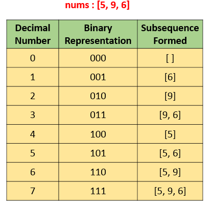

# 594 Longest Harmonious Subsequence

We define a harmonious array as an array where the difference between its maximum value and its minimum value is **exactly** `1`.

Given an integer array `nums`, return _the length of its longest harmonious subsequence among all its possible subsequences_.

A **subsequence** of array is a sequence that can be derived from the array by deleting some or no elements without changing the order of the remaining elements.

**Example 1:**

```
Input: nums = [1,3,2,2,5,2,3,7]
Output: 5
Explanation: The longest harmonious subsequence is [3,2,2,2,3].
```

**Example 2:**

```
Input: nums = [1,2,3,4]
Output: 2
```

**Example 3:**

```
Input: nums = [1,1,1,1]
Output: 0
```

**Constraints:**

* `1 <= nums.length <= 2 * 104`
* `-109 <= nums[i] <= 109`

这题很精彩，逐步推进优化，很值得研究。

解法一：brute force，把所有的subsequence找出来，每个check一下是不是LHS。T:O(2^n), S:O(1)。用找二进制的方法挑数，栗子：



具体实现参透了半天，首先把1左移到n的长度，这就是2^n个我们要生成比对的subsequence数目。然后在每个subsequnce，我们挑数，i中位置为1的，我们就在nums里找那个数出来。譬如，i = 2，010，j 从0到2找，j一直向左移，移到等于i有一的地方就会算一遍。

```java
public int findLHS(int[] nums) {
    if (nums == null || nums.length == 0) {
        return 0;
    }

    int res = 0;
    for (int i = 0; i < (1 << nums.length); i++) {
        int count = 0;
        int max = Integer.MIN_VALUE;
        int min = Integer.MAX_VALUE;
        for (int j = 0; j < nums.length; j++) {
            if ((i & (1 << j)) != 0) {
                int cur = nums[j];
                max = Math.max(max, cur);
                min = Math.min(min, cur);
                count++;
            }
        }
        if (max - min == 1) {
            res = Math.max(res, count);
        }
    }

    return res;
}
```

解法二：还是很brute force的，但是，这个只用T:O(n^2)和S:O(1)。这里，我们先定了这个sequence一定要包含某数nums\[i]。然后，我们从头扫到尾，找等于这个数或者比这个数大1的数。然后每次更新result。因为一定要diff by 1，所以要多加一个flag来记录有没有找到过diff by 1.

```java
public int findLHS(int[] nums) {
    if (nums == null || nums.length == 0) {
        return Integer.MIN_VALUE;
    }

    int longest = 0;

    for (int i = 0; i < nums.length; i++) {
        boolean flag = false;
        int count = 0;
        for (int j = 0; j < nums.length; j++) {
            if (nums[i] == nums[j]) {
                count++;
            } else if (nums[i] == nums[j] + 1) {
                count++;
                flag = true;
            }
        }
        if (flag) {
            longest = Math.max(longest, count);
        }
    }

    return longest;
}
```

解法三：排序再找。我们用count和pre\_count来记录，每次我们找到同样的，就算到pre\_count里。因为max和min一定要diff by one，所以不能直接加起来就算。当我们看到nums\[i] - nums\[i - 1] == 1的时候，才真正把结果加到count里。找到比现在数字大的数时，记得继续找。找到头了，才算result。还得记得把这个count赋值给pre\_count。因为可能下一个数比这个多一，我们要循环继续算。T:O(nlogn)&#x20;

```java
public int findLHS(int[] nums) {
    if (nums == null || nums.length == 0) {
        return Integer.MIN_VALUE;
    }

    Arrays.sort(nums);
    int res = 0;
    int pre_count = 1;
    for (int i = 0; i < nums.length; i++) {
        // 一开始要把自己算上，所以是1
        int count = 1;
        if (i > 0 && nums[i] - nums[i - 1] == 1) {
            while (i < nums.length - 1 && nums[i] == nums[i + 1]) {
                count++;                    
                i++;
            }

            res = Math.max(res, count + pre_count);
            pre_count = count;
        } else {
            while (i < nums.length - 1 && nums[i] == nums[i + 1]) {
                count++;                    
                i++;
            }

            pre_count = count;
        }
    }

    return res;
}
```

解法四：用hashmap来数数。首先用hashmap把每个数字出现得频率数一数。然后再loop一次数组，每次找有多少个与这个数key相同或等于key + 1的数。T:O(n), S:O(n)。

```java
public int findLHS(int[] nums) {
    if (nums == null || nums.length == 0) {
        return Integer.MIN_VALUE;
    }

    Map<Integer, Integer> map = new HashMap<>();
    for (int num : nums) {
        map.put(num, map.getOrDefault(num, 0) + 1);
    }

    int res = 0;
    for (int i = 0; i < nums.length; i++) {
        int count = map.get(nums[i]);
        if (map.getOrDefault(nums[i] + 1, 0) > 0) {
            res = Math.max(count + map.get(nums[i] + 1), res);
        }
    }

    return res;
}

// 参考答案
public int findLHS(int[] nums) {
    HashMap < Integer, Integer > map = new HashMap < > ();
    int res = 0;
    for (int num: nums) {
        map.put(num, map.getOrDefault(num, 0) + 1);
    }
    for (int key: map.keySet()) {
        if (map.containsKey(key + 1))
            res = Math.max(res, map.get(key) + map.get(key + 1));
    }
    return res;
}
```

解法五：其实还是用hashmap复杂度跟上面一样，就是一圈解决，不用扫两次。如果想一圈解决，就得同时考虑key + 1和key -1的情况。结果是max（res，count + keyPlusOne, count + keyMinusOne)

```java
public int findLHS(int[] nums) {
    if (nums == null || nums.length == 0) {
        return Integer.MIN_VALUE;
    }

    Map<Integer, Integer> map = new HashMap<>();
    int res = 0;
    for (int num : nums) {
        map.put(num, map.getOrDefault(num, 0) + 1);
        int keyPlusOne = map.getOrDefault(num + 1, 0);
        int keyMinusOne = map.getOrDefault(num - 1, 0);
        if (keyPlusOne != 0) {
            res = Math.max(Math.max(res, keyPlusOne + map.get(num)), keyMinusOne + map.get(num));
        }

        if (keyMinusOne != 0) {
            res = Math.max(Math.max(res, keyPlusOne + map.get(num)), keyMinusOne + map.get(num));
        }
    }

    return res;
}

// 参考答案
public int findLHS(int[] nums) {
    HashMap < Integer, Integer > map = new HashMap < > ();
    int res = 0;
    for (int num: nums) {
        map.put(num, map.getOrDefault(num, 0) + 1);
        if (map.containsKey(num + 1))
            res = Math.max(res, map.get(num) + map.get(num + 1));
        if (map.containsKey(num - 1))
            res = Math.max(res, map.get(num) + map.get(num - 1));
    }
    return res;
}
```

