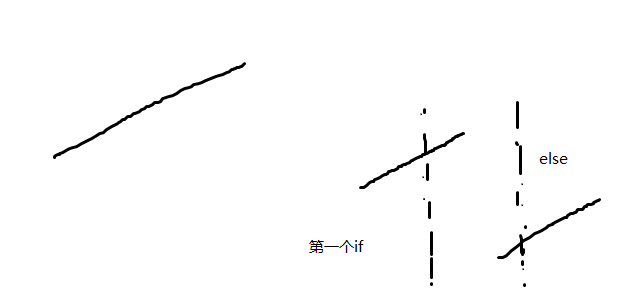

# L159 Find Minimum in Rotated Sorted Array

Suppose a sorted array is rotated at some pivot unknown to you beforehand.

(i.e.,`0 1 2 4 5 6 7`might become`4 5 6 7 0 1 2`).

Find the minimum element.

## Notice

You may assume no duplicate exists in the array.

**Example**

Given`[4, 5, 6, 7, 0, 1, 2]`return`0`

还是2分模板，这个没重复。还是找有序的一半，然后判断下标移动。想像一条斜线砍一半。竖线表示mid的位置，如果砍在左边，min在右边，如果砍在右边，min在左边。



```java
public int findMin(int[] nums) {
        if (nums == null || nums.length == 0) {
            return -1;
        }

        int start = 0;
        int end = nums.length - 1;
        while (start + 1 < end) {
            int mid = start + (end - start) / 2;
            //前半有序，找后半，因为中间本应该小于后面的，所以min在后半。
            if (nums[mid] > nums[end]) {
                start = mid;
            } else {//后半有序找前半
                end = mid;
            }
        }

        if (nums[start] < nums[end]) {
            return nums[start];
        } else {
            return nums[end];
        }

    }
```
