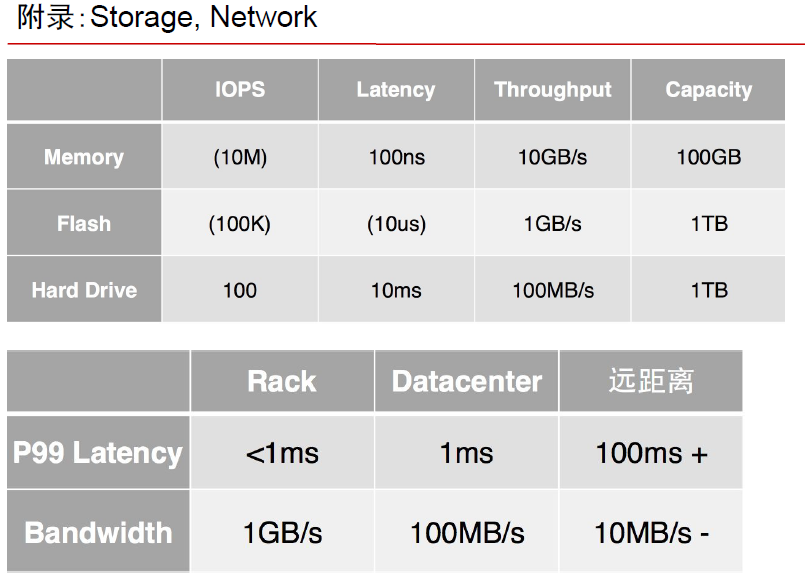

# 12 System Design

## **4 steps :**&#x20;

**Scenario** -- find out the use cases, under what circumstances the system is being used，搞QPS那些东西，读多写少之类的

**Service** -- once we found all the use cases, we need to divide the system into pieces，1，一开始可以每个功能搞一个service.2，把可以合并的service结合在一起。

**Storage** -- then we need to think about where to store data, how data flow from one point to another，为service选数据库,然后再考虑表的结构。是存内存，数据库还是文件系统呢？SQL noSQL之类的。最近还看到有columnar的DB和graph DB

**Scale** -- once we get a working solution, we need to think about the bottleneck and how to scale

**PS**:答题时忌讳摇摆不定。应该分析每个做法的pro\&con，能不能优化或者有么有workaround。或者直接折中，两个都要。继续往那个方向走下去。（除非你真走错了）具体参照下面关于优化

1. 加点cache for read heavy的system呀，cache存不鸟所有，那么存最近的100条etc；
2. 分类讨论呀，例如，大v用户用pull，普通用push之类的。
3. 用户习惯来优化，例如，我们刷微博不会一刷刷到去年的，所以只用在cache里，放用户常访问的数据就ok了
4. 还有根据用户地域特点，访问时间集中性之类的考虑
5. 还有，我们可以限制加好友数目来减低cache/存储的需求（eg江南百景图）
6. 还有我们可以存个时间戳，每次刷新cache时，只拿那个时间点之后的
7. 优化80%的用户

**Problem you may ask:**

1. How many the Daily Active User ? 1 or more web server ?
2. read heavy wirte heavy
3. same platform ? different platform --> web services
4. data need to be realtime ? uptodate every minutes ?
5. how many data ? 1 or multiply machine ?
6. SQL / NoSQL ? structure / non structure ?
7. latency concern ? need asynchronous call ?
8. Do we have infrastructure ? a startup may choose to use AWS etc
9. Learning curve of employee&#x20;
10. retention time, how long you need to store the data. limit in the imput, like twitter 140.

clarification -- get functionality & use case

amount -- usage pattern, visit amount, data amount

platform -- do we need to integrate with other system

constraints -- time sensitivity, real time response / overnight batch job

Algorithm -- we may use some algorithm, k merge sort etc

**关于计算：**

DAU ：daily active user，今天登陆了一次或以上就算1个。eg150M

QPS : query per second，每秒请求数目。等于 = DAU × 每个用户一天请求多少次 / 一天有多少秒。eg. 150M \* 60 / 86400 \~= 100k

Peak QPS : 峰值，通常是QPS乘以一个2 ～9 之间的数。

**关于server的QPS承受能力：**

SQL型，大概1k QPS / web Server：大概1k QPS / NoSQL(Cassandra呀mongo db呀)：大概10k QPS / 一台Memcached呀Redis呀：1M QPS（内存比硬盘快大概1000倍）

另外SQL可能不能horizontal shard，因为d join要join多个table，你点shard。

**关于优化：**

可以按照用户访问习惯优化，例如读多写少，可以用cache之类的。cache最近访问过的1000条之类的

更高级一点可以根据用户所在的地域优化，例如中国访user问中国server，美国user访问美国server。这个要注意的是，如果把web服务器跟数据库不放在一起的话，要注意一条用户request对应多少个数据库request。如果一条用户request对应一条数据库request的话，可以考虑把web server跟db server分开放（web放到靠近用户的地方，web跟db之间有网络延时）。但如果一条用户请求会产生n条数据库请求的话，把web跟db放一起比较好，因为n条db请求加起来网络延时会很高。

（有的地方可以不优化，例如like，10000个like和10001个like没啥区别，不一定要那么实时，eventually consistent就ok啦，过一轮统计一下，然后更新）

还有咩可以improve的时候可以话analytics。例如网站访问数，或者收集用户习惯之类的去根据用户优化。

**其他相关概念：**

pull vs push， fanout（把一条信息发给所有该收到信息的用户，可以后台异步执行）

异步，message queue （rabbitmq，kafka）,其实有两种，一种系preprocessing/offline batch，例如typeahead里将Trie另外process，过一段时间做一做。另一种是ajax咁的，send一个异步job然后立刻返回。当job完成了再收一个event notify user。（RabbitMQ tutorial的头三章可以研究吓）记住： **If you do something time-consuming, try to do it always asynchronously.**&#x20;

多线程，race condition

状态转换之间留一个gray area，例如，大于10加倍，小于5减半。.不要只用一个值，例如，大于8就double，小于8就half，这样会导致不稳定。

优化的时候，优化90%的用户就ok了

数据库的表可以多存一些冗余信息来加快访问。（denormalize）但要注意一致性问题。

网络会有latency，file system是网络的cache...

重试的时候要用到expenatial backoff，如果过了x时间发现没变化，下次可以过x/2时间再试；如果有变化，下次可以过2x时间再试。

多线程的限制因素：带宽有限，端口数有限，context switch有代价

系统里不用实时的部分可以offline batch处理数据。

可以用浏览器的cache来减少response时间，或者pre-fetch，例如搜a把ab，ac什么的也返回。因为网络延时是瓶颈，就等于你数据库一次返回多一点并不影响总体效率，因为磁盘读取是瓶颈，数据包的大小是其次。

关于master slave架构，slave上读数据可能会读到stale的，所以如果是实时性要求比较高的数据要从master上读。

cache里一般放读多写少而且不常改的数据，如果数据常常改的话，那么就得频繁回填

## 关于Distributed Storage：

Consistency: 如果写的node数目+读的node数目>存的数目，咁就得到strong consistency，如果唔系就只能eventually consistent

例如，写一个node，从一个node读，如果你只存一份，冇slave，strong consistency。如果你存2份，master+slave，咁就只能eventual consistent。另一个例子系，如果你存3份，写的时候，3个入边至少有两个返回成功才算写成功。读的时候，3个入边至少有两个读出来的数据相同才算读成功。这样你就considered系strong consistency

CAP Theorem：3个中只能要两个。consistency，availability & partition tolerance（部分node可能会offline一段时间然后 come back up。系offline呢段时间入边，即而partition的on going中，如果有人来read。你可以选择consistency，同reader讲，暂时not available。又或者选择availability，同reader讲，呢个系你要的答案，但不一定系对的，因为有一堆node offline。）

## 关于distributed计算：

**hadoop**，有个**HDFS**，如果你d文件唔系存系HDFS到，你map reduce意义唔大。然后因为个底层实现太烂，所以大家系上面加左好多layer，有个庞大的ecosystem令你写map reduce写得容易d。其中一个叫**Hive**。

然后**Spark**出来开始代替佢啦。map叫transform，reduce叫action。spark做左个data model将个大堆数据变成object。（以前叫RDD，而家叫DataSets，2017）比较developer friendly。而且Spark唔要求你将d也存系HDFS，你存系乜都得。

好，终于到**Kafka**啦。佢唔止系个messaging framwork。佢仲treat所有野as stream。所以你可以compute野on the fly。focus on real-time a nalysis。Spark其实都有，但好似话要个Spark cluster存好，然后你系上面操作。Kafka don't even need cluster

## 关于messaging：

因为好多人microservice， 所以messaging开始兴起。

所谓**microservice**就系将个大系统切开细细块，感觉就好似software design，你modulize d功能，然后以后改得简单。而且，有d模块可以重新用来组装其他大功能模块。

唔同的模块之间就系用呢d message来沟通的。

关键词：publisher/producer，subscribr/consumer。D野organize into topic，中有个叫broker的野就系你个cluster入边的一部脑，就系你条message queue，可能一个broker有好多个topic。然后仲有retention time。虽然大部分message都系short term storage。但new york times用kafka存报纸内容back to 1860年。

如果你有scale problem，你用多于一台computer存一个topic。咁呢d问题就来啦：例如，点保证message deliver exactly once，message的order。Distributed message queue会lost global topic wide ordering，但each partition可以保持顺序。（关于点样分d topic去唔同的broker，consistent hashing）

Memcache / redis :这种nosql里面存的是key和value，memcache就只支持一种值好象是list吧，然后redis可以支持list或set

Cassandra / HBase ： 这种的话能支持2个key，row key + column key + value，这样支持范围查询。这个column key可以是复合值，就像复合索引那样，但只支持一个index

sql和nosql数据库可以一起用，一个系统可以把不同的表存到不同的数据库里

关于cache和DB之间不枷锁没transaction的思考：

这4种做法都不能保证失败后的数据一致性。可以用zookeeper加分布式锁，慢，而且不能解决transaction回滚问题。业界通常选用4，因为4会在写多读少时出问题（大部分系统都是这种），3会在读多写少时出问题。

1. database.set(user); cache.set(key, user)
2. cache.set(key, user)；database.set(user);
3. cache.delete(key);database.set(user)&#x20;
4. database.set(user);cache.delete(key)

optimistic lock vs pessimistic lock

Pessimistic lock, lock everything then do something then release lock when you are done.

optimistic lock, use timestamp & version number. Everybody is allow to write, but before you write, you take a look at the version. When write back see if that version already changed, if not, just write it and update version. If so, read again and repeat. Good for application with lots of read but few writes

另外在系统设计的时候，如果是移动端的设计，例如手机什么的，我们需要考虑电池使用率，网速，还有cpu的能力。

random read/write vs sequential read/write, sequential is faster

L4 vs L7 load balancer

design patter : factory, singlton

vm vs container

pub/sub on queue

multi-threading, concurrency, locks, synchronization, CAS
