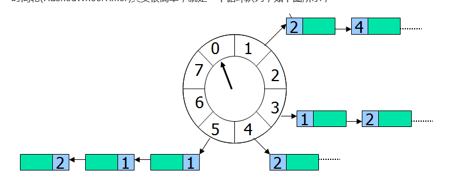
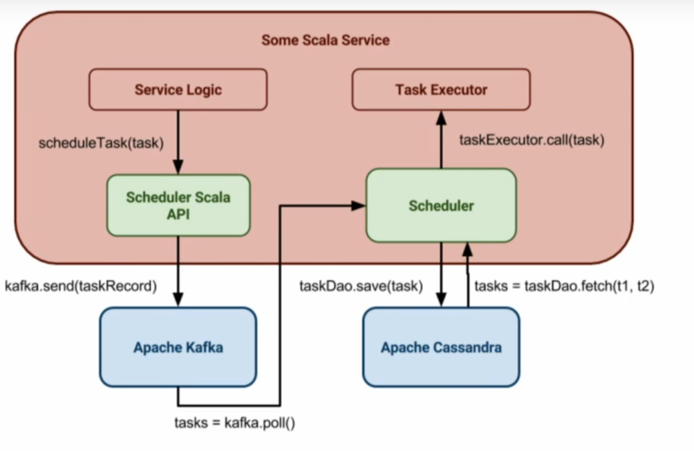

# Delay Schedule

感觉是要设计一个queue，一边有生产者放任务，任务有不同的执行时间，例如5s后执行，100s后执行。另一边有消费者拿任务。如果没任务，消费者就等着，有任务的时候，就先执行优先级高的（例如5s的那个）

这个设计需要考虑锁的问题，例如，消费者要等着队列不为空才能取，可以轮询但时间间隔设计不好的话会消耗无谓的cpu。

看到解释了java里的DelayQueue，基本上就是在队列里用锁来操控等待时间，所以外面的消费者直接take（）就能拿到东西了，而且take会自动阻塞等待执行时间。不用poll（）。

另一种实现方式是HashedWheelTimer，这个其实用一个队列表示时间。例如一个格子一秒，然后每隔一秒就看下一个格子。每次从队头拿task。然后每个任务加进去的时候，需要算一下要转多少圈能取。假设我们的wheel有10个格子，每个一秒。例如现在的时间是0，我们有一个任务进来，要4s之后执行，就把这个放到格子4里（+4的位置)。然后如果现在有个要20s后执行的，那么要把这个mod掉10，然后找对应的位置，现在还得记住要2圈以后才执行。不过没转一圈就得把这个格子里list上的任务圈数都减一，感觉这个方法挺好，但每次都得减一，（把所有task更新）好像有点慢。

然后下一个问题是scale了，怎么做成分布式的呢？[https://www.youtube.com/watch?v=s3GfXTnzG\_Y](https://www.youtube.com/watch?v=s3GfXTnzG_Y)

这是一个视频关于pager duty是怎么把这个delay schedule做成分布式的。其中用到了kafka和cassandra

Apache kafka - for task buffering & distribution

Apache Cassandra - for task persistence

Akka - for task execution

大概长这个样子：

[https://stackoverflow.com/questions/26094969/design-a-generic-job-scheduler](https://stackoverflow.com/questions/26094969/design-a-generic-job-scheduler)

[https://medium.com/netflix-techblog/distributed-delay-queues-based-on-dynomite-6b31eca37fbc](https://medium.com/netflix-techblog/distributed-delay-queues-based-on-dynomite-6b31eca37fbc)
