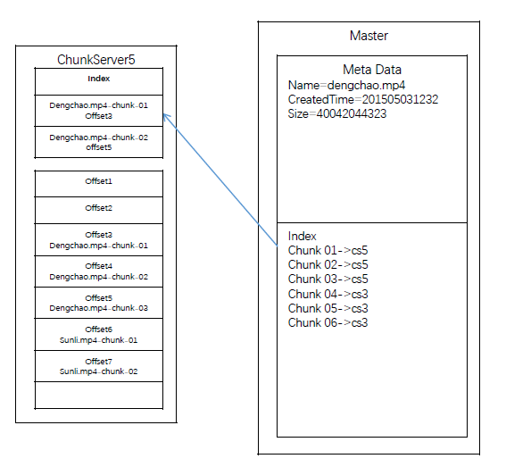

# Distributed File System(HDFS/GFS)

这是设计google file system（GFS），等于HDFS。google的不开源，用c++写的，HDFS开源，雅虎写的，用java

**Senario**:

很简单，就是读和写。但读/写的文件会很大。例如10P。

**Service**：

读 & 写，这里要考虑的是server是用p2p还是用master-slave。

因为p2p实现麻烦，一致性问题比较难，但没有single point of failure问题

用master-slave，实现简单，一致性没问题，缺点是single point of failure

注意：这里的master-slave跟数据库的不一样，数据库的master-slave是存同样东西的；这里的master存的是metadata，slave存的是文件的内容。

**Storage：（重点）**

* 因为metadata的访问比较频繁，根据硬盘特性，都存在一齐。
* 另外真正的文件会切成一块一块地存，这样的话修改容易。例如改完了以后文件大了，我们可以在后面加一块。
* 这里要注意每一块的大小，通常NTFS/XFS的块大小是4k，但因为我们存的文件都很大，如果没一块太小的话需要存很多metadata。要找个适中的size，通常一个trunk会是64M/128M
* 我们把文件切成很多块，然后每一块存在哪里，记录在master的metadata上；但具体文件块在chunk server的哪个offset存在slave上。这样如果slave自己要调整位置的话，master那边不用更新。下图来自九章，侵删。

* 根据经验，64M需要64B的metadata，那么10P大概需要10G的metadata
* 修改的时候，我们直接删掉重写

**Scale**：

* 如何防止数据丢失？
  * 我们需要做replica，重要的东西写3份；具体可以把其中两份存得比较近，另一份地域上比较远（以防地震什么的）
* 怎样发现disk坏掉呢？
  * 这里我们引入checksum，写的时候顺便写入。读的时候算一次，如果发现跟之前存的不一样，我们就认为disk出错了
  * checksum不会占很多位置，大概4byte左右；1P/64M×32bit = 62.5M的checksum
* 发现坏掉怎么办？
  * 这时候，坏掉的chunserver就要去Master那里找其他存了replica的server在哪里了
  * master把列表传给这个chunkServer，然后，这个就会去找另外一个存了copy的chunkserver拿数据
* 另外我们还要用heart beat来keep track of那些chunk server的health
* 现在client因为要写3份，所以可能成为瓶颈，解决方法是，在replica的那些server里选一个队长，每次client就只把数据传给队长，然后队长负责把数据写到另外两个chunk server上
* 如果所有写都完成了，队长会跟client报告写好了；如果写的时候某个chunk server挂掉了，这时候队长会说fail了。然后client要retry，再跟master要3个chunk server的位置
* 如果队长挂掉了，client怎么发现？client会有一个timeout，如果timeout了以后还没收到success，就会去master再要3个来retry
