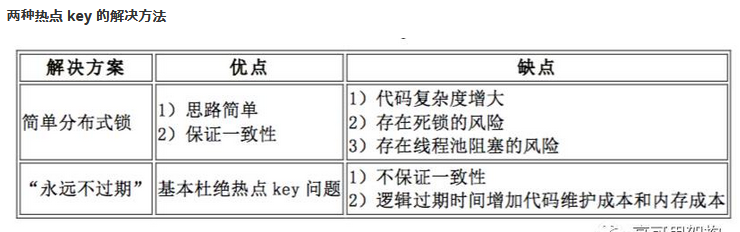

# News feed

设计twitter，这个系统本来很简单，主要考的是news feed的设计，push和pull。

有一堆功能可以实现，挑点重点的。

例如，post a tweet, timeline, news feed, friendship 的follow被follow之类的

**Scenario**：

读：日活 X 每个用户平均请求次数/一天的秒数 = 150M \* 60 / 86400 \~ 100k, peak \~ 300k

写：每日每人发一条，所以大概5k

**Service**：

* User Service - Register/Login&#x20;
* Tweet Service - Post a tweet/News Feed/ Timeline
* Media Service - Upload Image/ Upload Video
* Friendship Service - Follow/被follow

**Storage**：

* User Service - relational DB, 因为可能存在复杂的表单 MySQL，User Table

| id       | Integer |
| -------- | ------- |
| username | varchar |
| email    | varchar |
| password | varchar |

* Tweet Service - NoSQL，就tweet\_id, content，没有复杂结构 MongoDB, Tweet Table

| id          | integer     |
| ----------- | ----------- |
| user\_id    | Foreign Key |
| content     | text        |
| created\_at | timestamp   |

* Media Service - 文件系统S3之类的
* Friendship Service - 可SQL或NoSQL，Friendship table

| from\_user\_id | Foreign Key |
| -------------- | ----------- |
| to\_user\_id   | Foreign Key |
| created\_at    | timestamp   |

## PULL Model

读：每次发N个数据库请求去把所有关注的朋友的前100条Tweets拿过来做k路归并，最后返回前100条。

1. 用户打开app，刷首页
2. web server收到请求，去friendship table找这个用户的朋友s
3. 再去tweet table把朋友们的前100条拿过来《== 缺点，太多数据库请求了，会慢，用户要等
4. k路归并以merge到news feed里

写：每次一次DB write

**Scale**:

* 因为读DB是瓶颈，所以我们可以在访问DB前加cache。cache里存每个用户的最近100条信息。那么取朋友的最新100条就从DB读变成cache读了。
* 再进一步可以把news feed也存起来，加个时间戳。如果用户隔了10分钟再按了一下，可以把这10分钟的归并了，加到原来的上面。

## PUSH Model

另外建立一个News feed table，把所有用户的news feed都存这里

| id          | integer     |
| ----------- | ----------- |
| owner\_id   | foreign key |
| tweet\_id   | foreign key |
| created\_at | timestamp   |

读：每次从这个table里搜owner\_id = 用户的row，然后按时间排序，返回前100条

写：要写多条，把关注了这个用户的所有fans找出来，每个fans都会插一条记录。这个fanout过程可以异步执行。例如A关注了B，B发tweets的时候，table里除了加了一条 1， A， tweet1，XX之外，还会加一条2, B, tweet1, XX

**Scale**：

* 不活跃用户的写，是白写，可以按粉丝的活跃程度排序（last login time）
* 对于明星用户来说，fanout太慢

解决方法：push + pull

* 明星用户用pull
* 普通用户用push

如果follower超过1M的我们在user table里把TA标记成明星用户

关于掉粉变成普通用户，因为明星用pull，普通用户用push。如果一个明星用户发了一个帖（等着人pull）然后突然间变成普通用户（等着系统push），我们就会miss掉这些贴。

1. 或者我们继续浪费系统资源，push和pull都做
2. 我们要中间弄一个过度带，譬如1万以上（明星用户，只pull不push），5000到一万（伪明星用户，又push又pull），5000以下（普通用户，只push不pull）

其他拓展问题：

1. 关/取关之后news feed怎么加/删。follow之后异步把timeline merge进来，取关以后异步从news feed里把tweets跳出来删掉
2. likes怎么存？可以在tweet table里多存一份，denormalize，加一个like table，点赞之后只更新like table，定期从like table里把数据取过来更新。
3. Thundering Herd。这个现象出现在某一条热门消息如果不幸被踢出了缓存，然后在回填之前，又有一大堆request过来请求这条数据。这时候就会有好多request去DB要求回填，一下子就会搞崩数据库。避免方式是，在第一个请求过来cache miss的时候，我们hold住其他的request，等数据回填好了，再server。hold是用mutex锁，不放行其他thread，直到第一个request回填以后才放行。另一种防止方法是，“永不过期”缓存，就是热点key不会被evict。这会造成数据不一致(在等待回填时输出的是旧值）具体要看系统的要求。trade off

.png>)
