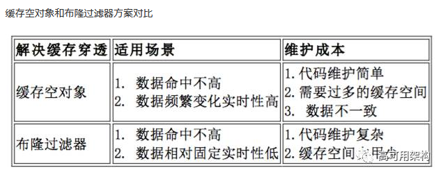

# 设计Memcache + 少少redis相关信息

这个的话，主要是两种算法[LRU](../../../my-notes/design/l134-lru.md)或[LFU](../../../my-notes/design/460-lfu.md)。接口（“service")就是那get(key), set(key, value, ttl)

其实主要考点是分布式，因为这个缓存是分布式的，那么我们应该怎么分呢？答案是：在客户端那边弄一下consistent hashing，把该存的东西hash到该存的地方。客户端那边有一个服务器列表（应该存着服务器的ip之类的吧）

原来还有memcacheDB，像redis一样能persistent

真memcache的设计：

它按照预先分配的大小，将分配的内存分割成特定长度的内存块，再把尺寸相同的内存块分成组，这些内存块不会释放，可以重复利用。

Memcached服务器端保存着一个空闲的内存块列表，当有数据存入时根据接收到的数据大小，分配一个能存下这个数据的最小内存块。这种方式有时会造成内存浪费，例如：将200字节的一个数据存入300字节的一个内存块中，就会有100字节的内存被浪费掉，不能被使用。

Memcached使用的是一种Lazy Expiration 策略，自己不会监控存入的“Key/Value”对是否过期，而是在获取Key值时查看记录的时间戳，检查“key/value”键值对的空间是否过期。这种策略不会在过期检测上浪费CPU资源

说起memcache还有另外一种cache through的东东，代表作是redis。

redis能防止Thundering Herd问题，（具体参照memcache拓展2）。

因为cache through的时候那块cache是跟DB真的连在一起，所以当cache miss，到DB找也没找到的情况，redis会回填一个空值到cache里，下一个来访问的用户通过cache miss就能知道，哦，这个DB没这个值呀。这个空值会有一段ttl，所以过一段时间还是能通过访问DB回填的。

那么在这段时间万一回填了，数据不就不一致了吗？解决方法是，在填DB的时候，把这个空值从cache里去掉。

另外还有一种防穿透的方法是用bloom filer帮助filter掉那些必定不在的东西。**这种方法适用于数据命中不高，数据相对固定实时性低（通常是数据集较大）的应用场景**，代码维护较为复杂，但是缓存空间占用少。

