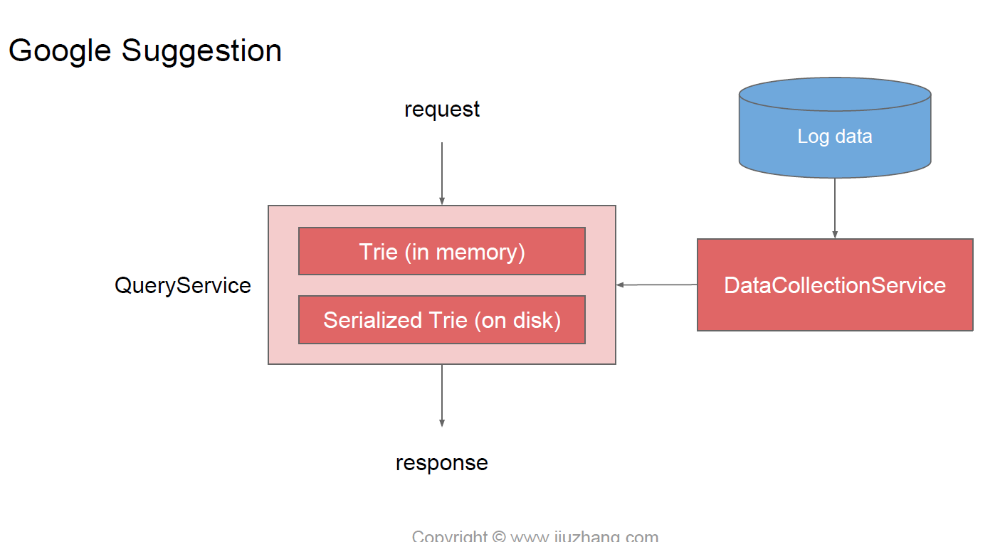

# typeahead

这个呢主要是想考Trie，其实存的时候也可以存成key value storage。

**senario**：

prefix -> top n search keywords

DAU:500m

search : 4 \* 6 \* 500m = 12B (every user search 6 times / day, every time types 4 letters)

QPS : 12b / 86400 \~ 138 k, peak \~ 300k

Service:

两个service：1 Query Service 2 DataCollectionService, 图来自九章课件，侵删

我们在DataCollectionService那里产生了这样的一张表：（感觉这里是hit counter的系统设计）

| Keyword  | hit\_count |
| -------- | ---------- |
| "amazon" | 20b        |
| "apple"  | 15b        |
| "adidas" | 7b         |
| "airbnb" | 3b         |
| ...      | ...        |

但上面的表查起来很慢，所以要转变成下面的表：

| prefix | keyword                            |
| ------ | ---------------------------------- |
| "a"    | \[“amazon”， “apple”,...]           |
| “am"   | \["amazon", "amc", ...]            |
| "ad"   | \["adidas", "adobe", ...]          |
| "don"  | \["don't have", "donald trup",...] |

具体是这样转的：（离线转）

1. 一开始表是空的，我们看到amazon有20b个，我们就插入“a": \["amazon, 20b"], "am": \["amazon, 20b"], "ama":\["amazon, 20b"], "amaz":\["amazon, 20b"], "amazo": \["amazon, 20b"], "amazon":\["amazon, 20b"]
2. 然后我们看到第二个单词，amazing有15b个，我们就插入“a":\["amazon, 20b"， "amazing, 15b"], "am": \["amazon, 20b"， "amazing, 15b"], "ama":\["amazon, 20b"， "amazing, 15b"], "amaz":\["amazon, 20b"， "amazing, 15b"], "amazi": \["amazing, 15b"], "amazin":\["amazing, 15b"],"amazing":\["amazing, 15b"]
3. 如此类推，每次比较一下，只存top10个在list里
4. 下一步就是用这个新的表来建trie

**Scale**：

shard Trie，shard的时候别按字母shard，a-k一个server，k-z另一个,这样不行

正确做法是hash（prefix），然后按hash出来的值，放到对应的server上。这样，“a”和“am”和“ad”会在不同的机器上
