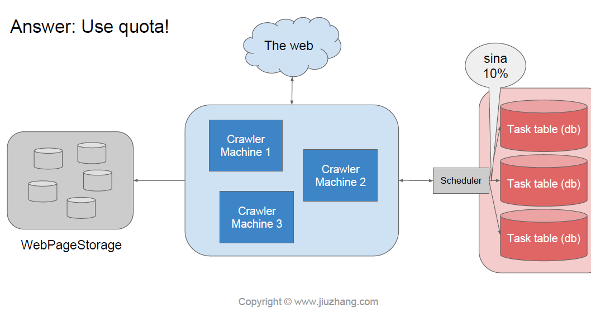

# web crawler

这个主要考multi thread的producer和consumer模型

**senario**:

web总共有1trillion个page，最好一周过一遍，所以大概crawl 1.6m web pages per second。

然后存储也要花很多空间，每个网页算10k，所以大概要存10petabyte网页

**Service**：

* Crawler X N个
* TaskService：分任务给crawler去爬
* StorageService：把网页存起来

**Storage**：

use db to store taks, bigTable to store web page

表单设计：

task table：(按域名来shard,然后有个priority，可以先抓高priority的，然后availabe time记录什么时候该再抓，这个时间可以用expanantial back off来算，state记录这个网站是否在处理中）

| id | url       | state     | priority | available\_time |
| -- | --------- | --------- | -------- | --------------- |
| 1  | sina.com  | "idle"    | 1        | Jan 3 11:30     |
| 2  | sina1.com | "working" | 1        | Jan 4 22:01     |
| 3  | sina2.com | "idle"    | 0        | Jan 3 02:00     |
| 4  | sina3.com | "idle"    | 2        | Jan 2 04:25     |

为了防止老抓新浪的url，可以用一个quota来限制每次schedule拿过来的有多少是新浪的。下图来自九章，侵删。
